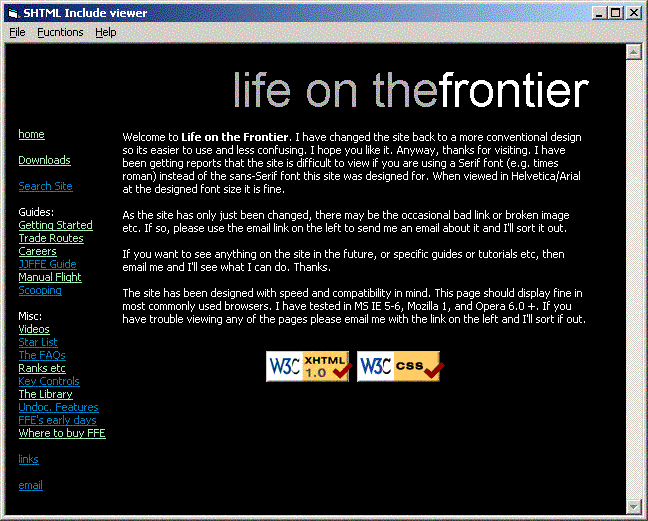



## SHTML Include Viewer

### Description

This little app will allow you to preview a complete .shtml/SSI webpage and its local include files as if it were a normal HTML page. I got annoyed having to upload to my server to see what they looked like!
 
### More Info
 

             |
---                |---
**Submitted On**   |2002-09-19 18:42:02
**By**             |[Matt Dibb](https://github.com/Planet-Source-Code/PSCIndex/blob/master/ByAuthor/matt-dibb.md)
**Level**          |Beginner
**User Rating**    |5.0 (10 globes from 2 users)
**Compatibility**  |VB 6\.0
**Category**       |[Internet/ HTML](https://github.com/Planet-Source-Code/PSCIndex/blob/master/ByCategory/internet-html__1-34.md)
**World**          |[Visual Basic](https://github.com/Planet-Source-Code/PSCIndex/blob/master/ByWorld/visual-basic.md)
**Archive File**   |[SHTML\_Incl1333709192002\.zip](https://github.com/Planet-Source-Code/matt-dibb-shtml-include-viewer__1-39106/archive/master.zip)

